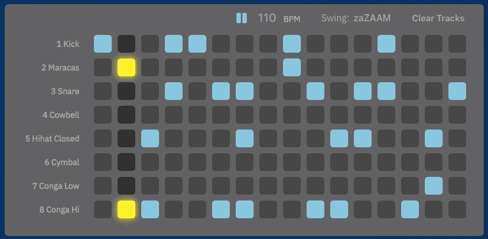

# Splat

[Click here to see it live!](https://splat-music.herokuapp.com)

Splat is an interactive, easy-to-use audio sampler and sequencer. Users can create beats by simply pressing keys or clicking. Like Hip Hop? 80s Synth Pop? Disco? Easily customize your sound by selecting one of the built in presets or mix and match up to 8 sounds manually. The sequencer allows users to layer samples over a four measure loop and create dynamic songs.

Splat features a wide bank of samples, presets, and 8 playback channels.

This project is inspired by classic drum machines like the Roland 808 and by later technologies (we're looking at you Ableton Live) that allow producers to build simple but engaging songs by selecting samples and triggering them in a grid layout.


## Samples!


At any given time, the user has access to eight samples that comprise a theme. Samples are accessible via the sample pad and are automatically loaded into the audio sequencer as well. 

```js
createAudioNodes() {
	if (!this.props.currentTheme || !this.props.currentSamples) return null;
	const audioNodes = this.props.currentSamples.map((sample) => {
           return new Tone.Player(sample.url).toMaster();
	});

	this.setState({ audioNodes });
}
```


We achieved lightweight audio playback by preloading sample data into Tone.Player, a responsive audio buffer component. Users can easily change the bank of samples with a `HandleTheme` dropdown menu, which dispatches an Axios call to Splat's API and retrieves the sample information from the Mongo database. That data then gets sent to a Samples Reducer and gets stored in a Redux state.  

```js
handleThemeSelect(e) {
  this.setState({ currentThemeId: e.target.value });
  this.props.chooseTheme(e.target.value);
}
```

```js
export const fetchTheme = themeId => {
  return axios.get(`/api/themes/${themeId}`)
}
```

## Sequencer!



At the center of our Sequencer is [Tone.js](https://tonejs.github.io/), a JavaScript library that helped us work out many of the kinks of asynchronous function calls: vanilla JS methods like setInterval and setTimeout have poor time accuracy and were not trustworthy enough for sample-accurate audio playback. We relied on Tone.Transport, which ensured sample accuracy and allowed us to flexibly adjust tempo and swing. 

